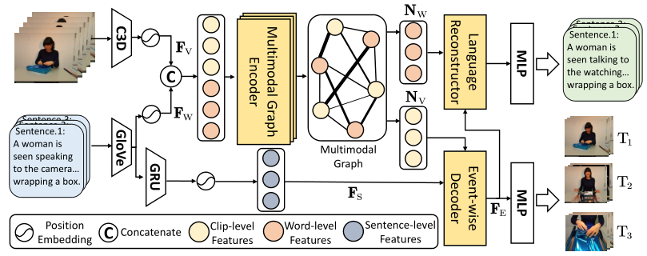
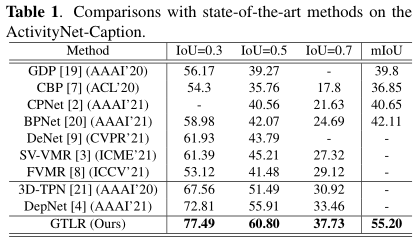
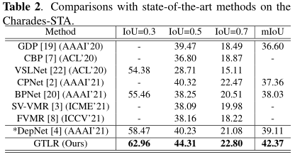

# Introduction

This is the codebase for our ICME2022 paper entitled *GTLR: Graph-based Transformer with Language Reconstruction*.

The overview of our proposed GTLR methods is depicted as follows:



# Preparation

Our code runs based on the following dependencies mainly:

- python3
- torch
- numpy
- torchtext
- torchvision
- ...

C3D features:

[ActivityNet-Caption](https://drive.google.com/file/d/1HNnP-cAFZlJV3n3ZGTLqWF84VBv4us7M/view?usp=sharing)

[Charades-STA](https://github.com/Alvin-Zeng/DRN)

GloVe:

[GloVe_840B_300d](https://nlp.stanford.edu/data/glove.840B.300d.zip)

# Running

Use the following command to train our model.

```Python
CUDA_VISIBLE_DEVICES=0 python main.py -c ./exps/TLG/GTLR_Anet.yaml
```

You can resume a checkpoint file by

```Python
CUDA_VISIBLE_DEVICES=0 python main.py -c ./exps/TLG/GTLR_Anet.yaml --resume $path to *.ckpt$
```

If you just want to evaluate a saved model file, use the following command.

```Python
CUDA_VISIBLE_DEVICES=0 python main.py -c ./exps/TLG/GTLR_Anet.yaml --test --load $path to *.best$
```

The results may be slightly higher or lower according to your settings, which doesn't influence the final conclusion.

# Overall Results

## Results on ActivityNet-Caption Dataset



## Results on Charades-STA Dataset



# Acknowledgement

If you are interesting in our work, please kindly cite our work according to

```ref
@inproceedings{GTLR2022ICME,
  author    = {Xun Jiang and
               Xing Xu Xu and
               Jingran Zhang and
               Fumin Shen and
               Zuo Cao and
               Xunliang Cai},
  title     = {GTLR: Graph-based Transformer with Language Reconstruction},
  booktitle = {ICME},
  year      = {2022},
}
```

Moreover, we sincerely thank the following works for their video features and codes.

```ref
@inproceedings{DRN2020CVPR,
  author    = {Runhao Zeng and
               Haoming Xu and
               Wenbing Huang and
               Peihao Chen and
               Mingkui Tan and
               Chuang Gan},
  title     = {Dense Regression Network for Video Grounding},
  booktitle = {CVPR},
  year      = {2020},
}

@inproceedings{densegrounding,
  author    = {Peijun Bao and
               Qian Zheng and
               Yadong Mu},
  title     = {Dense Events Grounding in Video},
  booktitle = {AAAI},
  year      = {2021}
}
```
